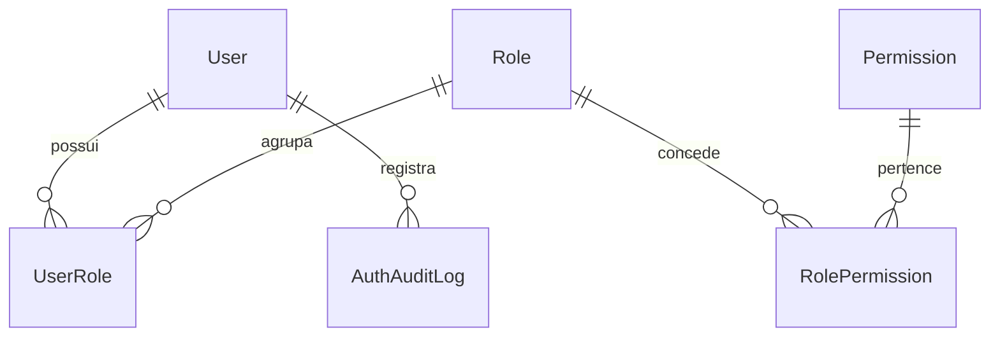

# Prompt 10 - Autenticacao, usuarios, permissoes e RBAC

## Visao geral

O Prompt 10 implementa a camada de seguranca do Nexor ERP: login JWT, refresh, logout com blacklist, usuario autenticado, troca de senha, RBAC por permissao, auditoria de autenticacao e protecao de rotas no frontend.

## Modelagem RBAC



## Backend

- `User`: usuario customizado com email unico, username unico, telefone, cargo, perfil principal e status ativo.
- `Role`: perfil de acesso, incluindo administrador, diretoria, financeiro, compras, estoque, fiscal, comercial, operacional e supervisor.
- `Permission`: permissao por codigo no padrao `modulo.recurso.acao`.
- `RolePermission`: vinculo entre perfil e permissao.
- `UserRole`: multiplos perfis por usuario, com perfil principal.
- `AuthAuditLog`: auditoria de login, falha, logout e troca de senha.

## APIs

- `POST /api/v1/auth/login/`
- `POST /api/v1/auth/refresh/`
- `POST /api/v1/auth/logout/`
- `GET /api/v1/auth/me/`
- `POST /api/v1/auth/change-password/`
- `GET/POST /api/v1/accounts/users/`
- `GET/PUT /api/v1/accounts/users/{id}/`
- `POST /api/v1/accounts/users/{id}/deactivate/`
- `POST /api/v1/accounts/users/{id}/activate/`
- `GET/POST /api/v1/accounts/roles/`
- `GET/PUT /api/v1/accounts/roles/{id}/`
- `POST /api/v1/accounts/roles/{id}/permissions/`
- `GET /api/v1/accounts/permissions/`
- `GET /api/v1/accounts/auth-audit/`

## JWT

- Access token curto configurado no `SIMPLE_JWT`.
- Refresh token longo com blacklist habilitada.
- Logout invalida o refresh token.
- Endpoints antigos `/api/v1/auth/token/` continuam disponiveis por compatibilidade.

## Permissoes

Foi criada a permission class reutilizavel:

```python
HasPermission("financeiro.conta_pagar.visualizar")
```

Tambem foi criado o helper `has_permission("...")` para uso direto em views.

## Seed inicial

Comando:

```powershell
docker compose exec backend python manage.py seed_rbac
```

Ele cria permissoes padrao, perfis padrao, usuario admin inicial e vincula todas as permissoes ao administrador.

## Frontend

- `AuthContext` global com usuario, tokens, login, logout e verificacao de permissao.
- Interceptor Axios injeta access token e renova automaticamente em 401.
- `ProtectedRoute` protege rotas autenticadas.
- `PermissionGuard` protege trechos de UI.
- Paginas de login, esqueci senha preparado, perfil, usuarios, perfis e acesso negado.
- Menu de usuario no header com logout.

## Testes

- Login valido.
- Login invalido.
- Usuario inativo bloqueado.
- RBAC permite/bloqueia.
- Administrador acessa tudo.
- Email duplicado bloqueado.
- Troca de senha.

## Melhorias futuras

- Rate limiting por IP/usuario.
- Recuperacao de senha por email transacional.
- MFA/TOTP.
- Expiracao de sessao por dispositivo.
- Tela de auditoria com filtros avancados.
