# Prompt 11 - Integracao global dos modulos

## 1. Arquitetura global do ERP

O Nexor passa a ter uma camada central em `apps.core` para integrar os modulos sem criar dependencias circulares. Os apps continuam donos das suas regras de negocio, enquanto `core` concentra eventos, auditoria, notificacoes, arquivos e orquestracao operacional.

## 2. Fluxos operacionais completos

- Comercial: cliente ativo gera orcamento, orcamento aprovado vira OS, OS finalizada pode ser faturada e integrada ao fiscal.
- Compras: solicitacao aprovada vira pedido, recebimento movimenta estoque e pode gerar conta a pagar.
- Estoque e OS: material usado em OS gera saida de estoque, custo operacional e evento global.
- Fiscal e financeiro: NFe autorizada integra estoque/financeiro e publica evento; NFe rejeitada gera alerta critico.
- CRM e comercial: cliente bloqueado impede fluxo comercial e prepara rastreabilidade por auditoria/eventos.

## 3. DER global

Entidades globais adicionadas:

```mermaid
erDiagram
  User ||--o{ AuditLog : registra
  User ||--o{ EventLog : publica
  User ||--o{ Notification : recebe
  EventLog ||--o{ Notification : gera
  AuditLog {
    bigint id
    string action
    string module
    string record_model
    string record_id
    json before
    json after
  }
  EventLog {
    bigint id
    string event_name
    string module
    string aggregate_type
    string aggregate_id
    string status
    json payload
  }
  Notification {
    bigint id
    string title
    string level
    string category
    bool is_read
  }
```

## 4. Estrutura de eventos

Criada a estrutura:

- `apps/core/events/base.py`
- `apps/core/events/dispatcher.py`
- `apps/core/events/handlers/financeiro_handlers.py`
- `apps/core/events/handlers/estoque_handlers.py`
- `apps/core/events/handlers/fiscal_handlers.py`
- `apps/core/events/handlers/notificacoes_handlers.py`

## 5. EventDispatcher

O `EventDispatcher` publica `InternalEvent`, grava `EventLog`, executa handlers registrados e marca o resultado como `processed` ou `partial`. Falhas de handler ficam registradas no evento sem quebrar o fluxo principal.

## 6. AuditService

O `AuditService` centraliza logs globais com usuario, acao, modulo, registro afetado, antes/depois, IP e metadados. Login/logout tambem alimentam auditoria global.

## 7. NotificationService

O `NotificationService` cria notificacoes internas, marca leitura e deixa preparados payloads para email e WhatsApp futuros.

## 8. Integracao entre modulos

Os services existentes agora publicam eventos em pontos criticos:

- `orcamento_aprovado`
- `os_finalizada`
- `os_faturada`
- `material_os_utilizado`
- `pedido_recebido`
- `nfe_autorizada`
- `nfe_rejeitada`
- `conta_paga`
- `conta_recebida`
- `estoque_baixo`

## 9. Fluxos transacionais

Os fluxos criticos seguem usando `transaction.atomic()` nos services dos modulos e no `ERPIntegrationService`.

## 10. Estrategia Celery

Criado `apps/core/tasks.py` com tarefa para processamento de eventos e base para digest de notificacoes. A arquitetura continua preparada para mover handlers pesados para filas.

## 11. Logs e auditoria

Auditoria global disponivel em `AuditLog`, protegida por RBAC e exposta em API para consulta operacional.

## 12. APIs globais

- `GET /api/v1/auditoria/logs/`
- `GET /api/v1/auditoria/logs/{id}/`
- `GET /api/v1/notificacoes/`
- `POST /api/v1/notificacoes/{id}/read/`
- `GET /api/v1/core/events/`

## 13. Testes de integracao

Criado `backend/apps/core/tests/test_events_audit_notifications.py` cobrindo evento publicado, handler executado, falha controlada em handler e auditoria global.

## 14. Estrutura frontend

Adicionado `globalService` e a pagina `/operacao`, que centraliza eventos, notificacoes e auditoria.

## 15. Componentes React

Criados:

- `NotificationDropdown`
- `TimelineGlobal`
- `AuditTable`
- `ActivityFeed`
- `SystemAlerts`
- `EventViewer`

## 16. Estrategia de desacoplamento

Os modulos publicam eventos com payload simples e nao conhecem handlers nem consumidores. Integracoes complexas ficam no `ERPIntegrationService`.

## 17. Explicacao tecnica

A decisao principal foi usar eventos internos persistidos em banco para garantir rastreabilidade empresarial. Isso permite auditar cada etapa e evoluir para Celery/Redis sem trocar a regra de negocio dos modulos.

## 18. Melhorias futuras

- Mover handlers pesados para Celery por configuracao.
- Criar WebSocket/SSE para notificacoes em tempo real.
- Adicionar dashboards com agregacoes cacheadas em Redis.
- Adicionar trilhas de auditoria imutaveis por hash encadeado.
- Expandir `ERPIntegrationService` com contratos formais por modulo.
