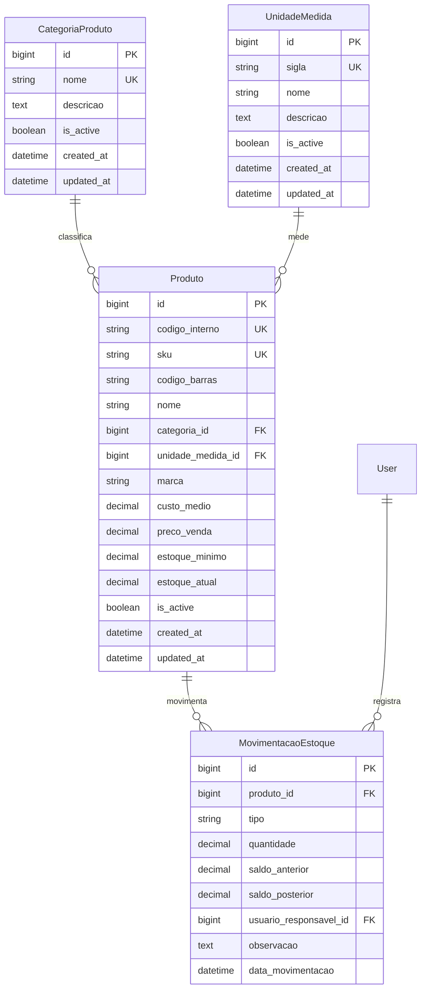

# Prompt 02 - Modulo de Estoque

## 1. Arquitetura do Modulo

O modulo `estoque` foi implementado como dominio real do ERP. A API fica em `/api/v1/estoque/`, as regras transacionais ficam em `services.py`, consultas reutilizaveis em `selectors.py`, persistencia especializada em `repositories.py`, validacoes em serializers/validators e views apenas orquestram HTTP.

## 2. DER Completo

## 3. Models Completas

Foram criadas `CategoriaProduto`, `UnidadeMedida`, `Produto` e `MovimentacaoEstoque`, com indices, constraints, soft delete para cadastros, auditoria preparada e historico imutavel de movimentacoes.

## 4. Serializers

Os serializers validam relacionamentos ativos, expõem campos derivados como categoria e unidade, protegem saldo atual como leitura e padronizam entrada de movimentacao.

## 5. Services

`EstoqueService` concentra entrada, saida e ajuste usando `transaction.atomic()` e `select_for_update()` para consistencia de saldo.

## 6. Selectors

Selectors aplicam `select_related`, ordenacao e filtros de ativos para reduzir duplicacao em views e services.

## 7. Repositories

Repositories isolam persistencia critica de produto e movimentacao, deixando a regra de negocio independente do ORM direto.

## 8. Views

Views usam viewsets enxutos, permissao autenticada/RBAC e responses padronizadas de sucesso e erro.

## 9. URLs

- `/api/v1/estoque/produtos/`
- `/api/v1/estoque/categorias/`
- `/api/v1/estoque/unidades-medida/`
- `/api/v1/estoque/movimentacoes/`
- `/api/v1/estoque/movimentacoes/entrada/`
- `/api/v1/estoque/movimentacoes/saida/`
- `/api/v1/estoque/movimentacoes/ajuste/`

## 10. Permissions

`CanManageEstoque` aceita usuarios autenticados com perfis `administrador`, `estoque`, `compras` e `supervisor`, mantendo a base pronta para RBAC mais granular.

## 11. Validacoes

Foram implementados SKU unico, codigo interno unico, estoque minimo nao negativo, quantidade positiva, produto ativo e bloqueio de saida sem saldo.

## 12. Endpoints

Produtos e categorias possuem CRUD REST. Movimentacoes possuem listagem e acoes especificas para entrada, saida e ajuste, evitando ambiguidade no contrato da API.

## 13. Fluxo de Movimentacao

1. API valida produto ativo e quantidade.
2. Service abre transacao.
3. Produto e bloqueado com `select_for_update`.
4. Saldo anterior e calculado.
5. Entrada soma, saida subtrai com validacao, ajuste define saldo final.
6. Produto e atualizado.
7. Historico e registrado em `MovimentacaoEstoque`.

## 14. Testes

Foram criados testes unitarios para entrada, saida, ajuste e bloqueio de saldo negativo, alem de testes de API para cadastro de produto e movimentacoes.

## 15. Estrutura Frontend

Foram criadas paginas de produtos, cadastro de produto, movimentacao e historico, mantendo chamadas HTTP em services.

## 16. Componentes React

Foram adicionados `DataTable`, `FormField`, `Modal` e `Toast` como componentes reutilizaveis.

## 17. Integracao Axios

`stockService.js` centraliza integracao com produtos, categorias, unidades e movimentacoes via `apiClient`.

## 18. Explicacao Tecnica

O saldo nunca e alterado diretamente pela view. O service transacional e a fonte unica de verdade para movimentacoes, protegendo concorrencia e preservando historico. Produtos usam soft delete, mas movimentacoes nao sao apagadas para manter auditoria.

## 19. Melhorias Futuras

- Implementar empresas/filiais e almoxarifados.
- Criar lote, localizacao fisica e numero de serie.
- Adicionar importacao de inventario.
- Integrar compras e ordens de servico.
- Evoluir RBAC para permissoes por acao e empresa.
