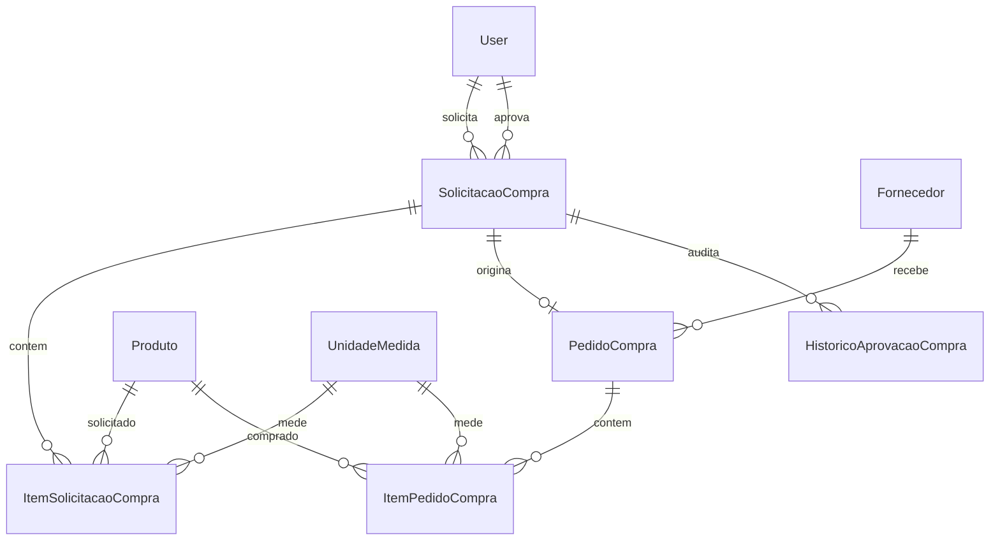

# Prompt 03 - Modulo de Compras

## 1. Visao Geral do Modulo

O modulo de Compras controla solicitacoes, aprovacao, pedidos, fornecedores e recebimentos, mantendo integracao preparada com Estoque e Financeiro. A regra de negocio fica concentrada em `ComprasService`, com views apenas orquestrando HTTP.

## 2. DER Completo

## 3. Models

Foram implementadas `SolicitacaoCompra`, `ItemSolicitacaoCompra`, `PedidoCompra`, `ItemPedidoCompra`, `HistoricoAprovacaoCompra` e `Fornecedor`, com choices para status/prioridade, indices, constraints e auditoria preparada.

## 4. Serializers

Serializers suportam payloads aninhados de itens, validam item sem produto cadastrado via descricao livre, bloqueiam listas vazias e protegem campos calculados.

## 5. Services

`ComprasService` implementa criacao de solicitacao, envio para aprovacao, aprovacao, reprovacao, cancelamento, conversao em pedido, criacao de pedido e recebimentos parcial/total.

## 6. Selectors

Selectors usam `select_related` e `prefetch_related` para solicitacoes, pedidos, itens, produtos, unidades e fornecedor.

## 7. Repositories

Repositories isolam consultas com `select_for_update` para solicitacoes e pedidos em fluxos transacionais.

## 8. Views

Views usam viewsets e actions REST, mantendo regra de negocio no service e retornos padronizados.

## 9. URLs

- `/api/v1/compras/solicitacoes/`
- `/api/v1/compras/solicitacoes/{id}/enviar-aprovacao/`
- `/api/v1/compras/solicitacoes/{id}/aprovar/`
- `/api/v1/compras/solicitacoes/{id}/reprovar/`
- `/api/v1/compras/solicitacoes/{id}/cancelar/`
- `/api/v1/compras/solicitacoes/{id}/converter-pedido/`
- `/api/v1/compras/pedidos/`
- `/api/v1/compras/pedidos/{id}/recebimento-parcial/`
- `/api/v1/compras/pedidos/{id}/recebimento-total/`
- `/api/v1/compras/pedidos/{id}/cancelar/`

## 10. Permissions

RBAC preparado para administrador, compras, supervisor, estoque e financeiro, com classes separadas para visualizar, gerenciar, aprovar e receber pedidos.

## 11. Validacoes

Foram implementadas validacoes para solicitacao com itens, quantidade positiva, motivo de reprovacao, status correto para aprovacao/conversao, fornecedor obrigatorio, valor unitario nao negativo e recebimento sem exceder a compra.

## 12. Endpoints

Os endpoints de solicitacoes e pedidos seguem REST com actions especificas para transicoes de estado.

## 13. Fluxo de Aprovacao

Rascunho -> pendente de aprovacao -> aprovada/reprovada. Cada transicao cria `HistoricoAprovacaoCompra`.

## 14. Fluxo de Pedido

Solicitacao aprovada pode virar pedido. Pedido pode ser recebido parcialmente, recebido totalmente ou cancelado conforme status.

## 15. Integracao com Estoque

Recebimentos chamam `EstoqueService.registrar_entrada`, preservando a regra de saldo exclusivamente no modulo de Estoque.

## 16. Testes

Foram criados testes de service e API para criacao, bloqueio sem itens, aprovacao, reprovacao, conversao em pedido e recebimento acima da quantidade.

## 17. Estrutura Frontend

Foram criadas telas de lista, cadastro e detalhes de solicitacoes, lista/detalhe de pedidos e registro de recebimento.

## 18. Componentes React

Foram adicionados badges de status e reaproveitados tabela, modal, toast e campos padronizados.

## 19. Explicacao Tecnica

Compras nao atualiza estoque diretamente. O recebimento delega a entrada ao service de Estoque, mantendo integridade transacional e uma trilha clara de auditoria.

## 20. Melhorias Futuras

- Cotacao com multiplos fornecedores.
- Alçadas de aprovacao por valor.
- Integracao com contas a pagar.
- Recebimento fiscal com XML/NFe.
- Centro de custo estruturado e multiempresa.
