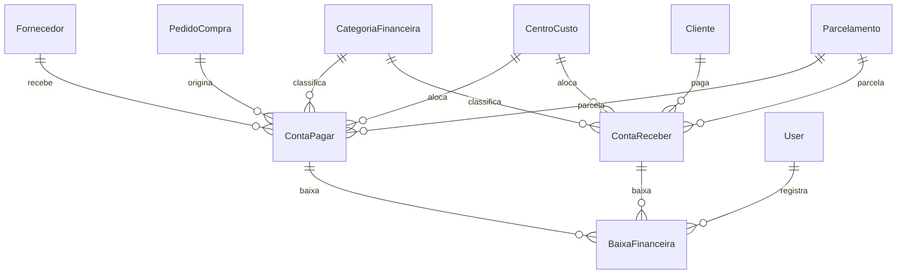

# Prompt 04 - Modulo Financeiro

## 1. Arquitetura Financeira

O modulo financeiro foi implementado com models separados para cadastros financeiros, contas, baixas e parcelamentos. As regras ficam em `FinanceiroService`, usando `Decimal` e `transaction.atomic()`.

## 2. DER Completo

## 3. Models

Foram criados `CentroCusto`, `CategoriaFinanceira`, `Parcelamento`, `ContaPagar`, `ContaReceber` e `BaixaFinanceira`, alem do `Cliente` minimo para contas a receber.

## 4. Serializers

Serializers validam categorias por tipo, protegem status/saldo e expõem nomes derivados de fornecedor, cliente, categoria e centro de custo.

## 5. Services

`FinanceiroService` cria contas, baixa contas, cancela lancamentos, atualiza status e gera parcelamentos.

## 6. Selectors

Selectors consolidam listagens otimizadas, fluxo de caixa e dashboard financeiro.

## 7. Repositories

Repositories usam `select_for_update` para contas em operacoes de baixa.

## 8. Views

Viewsets REST para contas, categorias e centros de custo, alem de views de dashboard e fluxo de caixa.

## 9. URLs

- `/api/v1/financeiro/contas-pagar/`
- `/api/v1/financeiro/contas-pagar/{id}/baixar/`
- `/api/v1/financeiro/contas-pagar/{id}/cancelar/`
- `/api/v1/financeiro/contas-receber/`
- `/api/v1/financeiro/contas-receber/{id}/baixar/`
- `/api/v1/financeiro/contas-receber/{id}/cancelar/`
- `/api/v1/financeiro/fluxo-caixa/`
- `/api/v1/financeiro/dashboard/`

## 10. Permissions

RBAC preparado para administrador, financeiro, supervisor e visualizacao parcial de compras.

## 11. Enums

Enums centralizam tipos financeiros, status de contas a pagar, status de contas a receber e tipos de baixa.

## 12. Validacoes

Bloqueio de baixa maior que saldo, valores negativos, categoria/centro obrigatorios, vencimento invalido e cancelamento apos quitacao.

## 13. Fluxo Financeiro

Conta nasce pendente com `valor_original` e `valor_atual`. Baixas reduzem saldo e recalculam status.

## 14. Fluxo de Baixas

Baixas ficam em tabela separada e preservam historico. O lancamento principal recebe apenas o saldo e status atualizados pelo service.

## 15. Fluxo de Parcelamento

O service gera vencimentos mensais e valor de parcela, mantendo `Parcelamento` como origem rastreavel.

## 16. Integracao com Compras

`ContaPagar` pode referenciar `PedidoCompra`. O service bloqueia duplicidade de conta ativa para o mesmo pedido.

## 17. Dashboard Financeiro

Dashboard retorna total a pagar, total a receber, vencidos e saldo projetado.

## 18. Testes

Foram criados testes de criacao de conta, baixa parcial, baixa total, bloqueio de baixa invalida e parcelamento.

## 19. Estrutura Frontend

Telas iniciais para dashboard financeiro, contas a pagar, contas a receber, cadastro financeiro e fluxo de caixa.

## 20. Componentes React

Incluido `FinancialCard` e reutilizados tabela, badges, campos e toast.

## 21. Explicacao Tecnica

Dinheiro usa `Decimal`, baixas sao historicas e transacionais, e calculos financeiros ficam no backend.

## 22. Melhorias Futuras

- Conciliacao bancaria.
- Extratos e contas bancarias.
- Alçadas financeiras.
- Integracao fiscal/NFe.
- Contas recorrentes.
