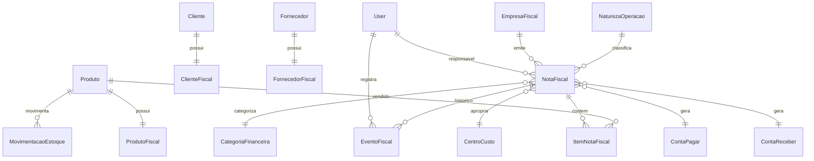

# Entrega Prompt 05 - Modulo Fiscal e NFe

## 1. Visao geral

O modulo fiscal foi implementado para centralizar cadastro fiscal, natureza de operacao, emissao de NF-e, eventos, XML, DANFE e integracoes controladas com estoque e financeiro. A emissao usa fluxo rastreavel: rascunho, validacao, assinatura, envio, autorizacao, rejeicao e cancelamento.

## 2. DER completo

## 3. Models

Foram criados `EmpresaFiscal`, `ClienteFiscal`, `FornecedorFiscal`, `ProdutoFiscal`, `NaturezaOperacao`, `NotaFiscal`, `ItemNotaFiscal` e `EventoFiscal`, com constraints, indices, auditoria e soft delete onde faz sentido.

## 4. Serializers

Os serializers expõem cadastro fiscal, naturezas e NF-e com itens e eventos. Valores fiscais calculados pelo backend ficam como leitura.

## 5. Services

`FiscalService` concentra regras de negocio: criar NF-e, validar dados fiscais, calcular totais/impostos com `Decimal`, assinar XML, enviar, cancelar, gerar DANFE e integrar estoque/financeiro com `transaction.atomic()`.

## 6. Selectors

Selectors dedicados listam empresas, clientes fiscais, fornecedores fiscais, produtos fiscais, naturezas, notas e eventos com `select_related` e `prefetch_related`.

## 7. Repositories

`NotaFiscalRepository` prepara acesso transacional e carregamento completo da NF-e para evolucoes futuras.

## 8. Views

ViewSets REST foram criados para empresa fiscal, dados fiscais de clientes/fornecedores/produtos, naturezas e NF-e. A NF-e possui actions para validar, assinar, enviar, cancelar, baixar DANFE e baixar XML.

## 9. URLs

Endpoints publicados em `/api/v1/fiscal/`: `empresa/`, `clientes-fiscais/`, `fornecedores-fiscais/`, `produtos-fiscais/`, `naturezas-operacao/` e `nfe/`.

## 10. Permissions

RBAC preparado com `CanViewFiscal` e `CanManageFiscal`. Administrador e fiscal gerenciam; financeiro, estoque, operacional e supervisor visualizam conforme perfil.

## 11. Enums

Enums cobrem ambiente fiscal, regime tributario, tipo de operacao, status da NF-e e tipos de eventos fiscais.

## 12. Validacoes fiscais

Validadores cobrem CNPJ, CPF, CPF/CNPJ, CEP, municipio IBGE, NCM e CFOP. O backend exige produto fiscal, destinatario fiscal, certificado digital e NF-e com itens antes de seguir fluxo.

## 13. Integracao SEFAZ desacoplada

`SefazClient` isola o envio/cancelamento e retorna respostas padronizadas para autorizacao ou rejeicao, pronto para substituicao por integracao real.

## 14. XML builder

`NFeXmlBuilder` monta XML fiscal a partir da NF-e, sem regra fiscal nas views ou serializers.

## 15. DANFE generator

`DanfeGenerator` gera artefato PDF simplificado via `ContentFile`, mantendo a interface pronta para motor real de DANFE.

## 16. Certificate manager

`CertificateManager` protege a senha com `django.core.signing` e valida presenca de certificado A1 e senha protegida. A senha nao e retornada pelo serializer.

## 17. Fluxo de emissao

1. Criar NF-e em rascunho.
2. Calcular itens, totais e impostos no backend.
3. Validar dados fiscais.
4. Assinar XML.
5. Enviar para SEFAZ.
6. Registrar autorizacao ou rejeicao.
7. Integrar estoque e financeiro somente apos autorizacao.

## 18. Fluxo de cancelamento

NF-e autorizada pode ser cancelada com justificativa minima. O evento e registrado e o XML de cancelamento fica armazenado.

## 19. Integracao com estoque

Venda autorizada gera saida de estoque e compra autorizada gera entrada, somente se a natureza movimentar estoque.

## 20. Integracao com financeiro

Venda autorizada pode gerar conta a receber e compra autorizada pode gerar conta a pagar quando categoria e centro de custo estiverem informados.

## 21. Testes

Foram adicionados testes de servico para criacao de NF-e, calculo de totais/impostos, fluxo validar-assinar-enviar, autorizacao e movimentacao de estoque, alem do bloqueio de assinatura sem certificado.

## 22. Estrutura frontend

Foram criadas telas em `frontend/src/pages/fiscal/` para empresa fiscal, naturezas, lista de NF-e, nova NF-e e detalhe da NF-e.

## 23. Componentes React

O frontend reutiliza `DataTable`, `StatusBadge`, `FormField` e adiciona status fiscais, acoes de fluxo de NF-e, eventos visiveis, download de DANFE/XML e formularios fiscais.

## 24. Explicacao tecnica

O modulo segue separacao por camadas: models persistem estado, serializers validam contrato de API, services executam regras, selectors otimizam leitura, integrations isolam dependencias fiscais externas e views apenas orquestram entrada/saida HTTP.

## 25. Melhorias futuras

- Implementar SEFAZ real com assinatura ICP-Brasil.
- Criar inutilizacao de numeracao.
- Gerar DANFE com layout oficial.
- Enviar XML por email.
- Criar estorno fiscal/financeiro/estoque no cancelamento.
- Refinar regras de IE por UF.
- Adicionar timeline visual dedicada e modal de cancelamento com confirmacao.
