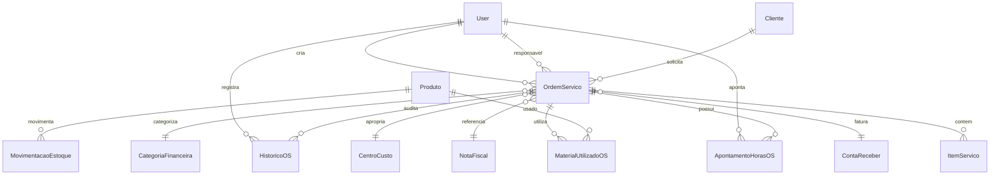

# Entrega Prompt 06 - Modulo de Ordens de Servico

## 1. Visao geral

O modulo de Ordens de Servico foi implementado para controlar o ciclo operacional de servicos: criacao, aprovacao, execucao, pausa, retomada, finalizacao, cancelamento, uso de materiais, apontamento de horas, custos, faturamento e preparacao para vinculo fiscal.

## 2. DER completo

## 3. Models

Foram criados `OrdemServico`, `ItemServico`, `MaterialUtilizadoOS`, `ApontamentoHorasOS` e `HistoricoOS`, com constraints de valores positivos, indices por status, cliente, prioridade e datas, auditoria e soft delete em OS.

## 4. Serializers

Serializers expõem OS com itens, materiais, apontamentos e historico. Totais, custos e horas calculadas ficam protegidos como leitura.

## 5. Services

`OrdemServicoService` concentra regras de negocio com `transaction.atomic()`: criar OS, transicoes de status, materiais, apontamentos, custos, faturamento e historico.

## 6. Selectors

Selectors usam `select_related` e `prefetch_related` para listar OS, materiais, apontamentos e historico com queries previsiveis.

## 7. Repositories

Repositories encapsulam leitura com `select_for_update()` para OS, materiais e apontamentos em operacoes transacionais.

## 8. Views

`OrdemServicoViewSet` publica endpoints REST para CRUD de OS e actions de fluxo: enviar para aprovacao, aprovar, iniciar, pausar, retomar, finalizar, cancelar, faturar, materiais, apontamentos e historico.

## 9. URLs

Endpoints publicados em `/api/v1/os/`, incluindo rotas aninhadas `/materiais/`, `/apontamentos/` e `/historico/`.

## 10. Permissions

RBAC preparado com `CanViewOrdensServico`, `CanManageOrdensServico`, `CanApproveOrdensServico` e `CanBillOrdensServico`.

## 11. Enums

Enums cobrem status da OS, prioridade, tipo de hora e eventos de historico.

## 12. Validacoes

O backend bloqueia OS sem cliente, alteracao livre em OS finalizada/cancelada/faturada, material sem saldo, quantidade invalida, hora fim menor que inicio, sobreposicao de horario e faturamento duplicado.

## 13. Fluxo da OS

Criar OS, enviar para aprovacao, aprovar, iniciar execucao, pausar, retomar, finalizar, faturar ou cancelar conforme status permitido.

## 14. Fluxo de materiais

Material utilizado valida produto ativo, quantidade e saldo, registra saida via `EstoqueService`, calcula custo e grava historico. Remocao estorna estoque via entrada.

## 15. Fluxo de apontamento de horas

Apontamento calcula horas no backend, aplica tipo normal/extra, calcula custo de mao de obra e bloqueia sobreposicao por colaborador e data.

## 16. Integracao com estoque

Toda baixa de material passa por `EstoqueService.registrar_saida()`. O produto nunca e atualizado diretamente pelo modulo de OS.

## 17. Integracao com financeiro

OS faturada gera `ContaReceber` via `FinanceiroService`, usando cliente, categoria, centro de custo, valor final e data de vencimento.

## 18. Integracao com fiscal

`OrdemServico` possui vinculo preparado com `NotaFiscal`, permitindo evoluir para emissao de NFe a partir de OS faturada sem duplicar regras fiscais.

## 19. Testes

Foram adicionados testes de servico para criacao, fluxo de status, bloqueio de edicao finalizada, materiais com/sem saldo, apontamentos, sobreposicao, faturamento e bloqueio de OS cancelada no financeiro.

## 20. Estrutura frontend

Foram criadas telas em `frontend/src/pages/ordensServico/` para lista, nova OS e detalhe operacional.

## 21. Componentes React

O frontend reutiliza tabela, formulario, cards financeiros e status badge, alem do novo `PriorityBadge`. A tela de detalhe contempla acoes de fluxo, materiais, apontamentos, historico e faturamento.

## 22. Explicacao tecnica

O modulo segue a arquitetura por camadas do Nexor: models persistem estado, services executam regras, views orquestram HTTP, selectors otimizam consulta, repositories isolam locks transacionais e o frontend consome a API sem calcular valores criticos.

## 23. Melhorias futuras

- Criar orcamentos formais vinculados a OS.
- Criar apontamento por equipe e agenda.
- Implementar precificacao por tabela de servico.
- Vincular emissao fiscal automatica no faturamento.
- Criar estornos financeiros estruturados.
- Adicionar anexos, fotos e assinaturas de aceite.
- Refinar filtros por periodo no backend.
