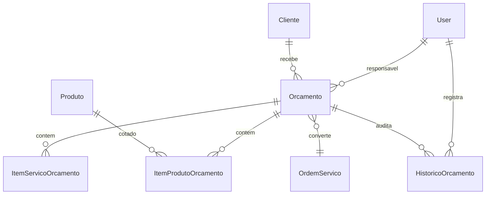

# Entrega Prompt 07 - Modulo de Orcamentos

## 1. Visao geral

O modulo de Orcamentos foi implementado para controlar propostas comerciais, itens de produtos, itens de servicos, descontos, margens, aprovacao/reprovacao, PDF e conversao em Ordem de Servico.

## 2. DER completo

## 3. Models

Foram criados `Orcamento`, `ItemProdutoOrcamento`, `ItemServicoOrcamento` e `HistoricoOrcamento`, com auditoria, soft delete em orcamento, constraints monetarias e indices por status, cliente e validade.

## 4. Serializers

Serializers expõem orcamento com itens de produto, itens de servico e historico. Totais, margem, custo total, usuario e vinculo de OS ficam protegidos como leitura.

## 5. Services

`OrcamentoService` concentra regras com `transaction.atomic()`: criar, atualizar, calcular totais/margem, enviar, aprovar, reprovar, cancelar, expirar, converter em OS e gerar PDF.

## 6. Selectors

Selectors listam orcamentos e historico com `select_related` e `prefetch_related` para consultas otimizadas.

## 7. Repositories

`OrcamentoRepository` encapsula carregamento ativo e transacional com `select_for_update()`.

## 8. Views

`OrcamentoViewSet` publica CRUD e actions para enviar, aprovar, reprovar, cancelar, converter em OS, gerar PDF e consultar historico.

## 9. URLs

Endpoints publicados em `/api/v1/orcamentos/`.

## 10. Permissions

RBAC preparado com `CanViewOrcamento`, `CanManageOrcamento` e `CanApproveOrcamento`. O perfil `comercial` foi adicionado ao usuario.

## 11. Enums

Enums cobrem status comercial e eventos do historico do orcamento.

## 12. Validacoes

O backend exige cliente, ao menos um item, quantidade positiva, valores nao negativos, validade nao vencida, motivo para reprovacao e bloqueia edicao livre apos aprovacao/conversao/cancelamento.

## 13. Fluxo do orcamento

Criar em rascunho, calcular itens, enviar ao cliente, aprovar/reprovar/cancelar, gerar PDF e converter em OS quando aprovado.

## 14. Fluxo de aprovacao/reprovacao

Aprovacao bloqueia edicao livre e permite conversao em OS. Reprovacao exige motivo e registra historico.

## 15. Fluxo de conversao em OS

Orcamento aprovado cria OS via `OrdemServicoService`, leva itens de servico para a OS e grava vinculo `ordem_servico`, bloqueando conversao duplicada.

## 16. Geracao de PDF

`OrcamentoPdfGenerator` gera artefato PDF simplificado e registra evento no historico, mantendo camada pronta para layout profissional futuro.

## 17. Integracao com estoque

Orcamento consulta produto e custo atual, mas nao movimenta estoque e nao reserva saldo nesta etapa.

## 18. Integracao com OS

Conversao em OS usa o service de Ordens de Servico e preserva rastreabilidade por vinculo direto no orcamento.

## 19. Integracao com financeiro

Condições de pagamento foram modeladas, mas o orcamento nao gera conta a receber. A geracao financeira permanece no faturamento da OS.

## 20. Integracao com fiscal

NFe futura fica preparada para o fluxo posterior de venda/faturamento. Nenhuma regra fiscal e duplicada no modulo de orcamentos.

## 21. Testes

Foram adicionados testes de servico para criacao valida, bloqueios sem cliente/itens, totais, descontos, aprovacao, reprovacao, cancelamento, bloqueio de edicao, conversao em OS, duplicidade e PDF.

## 22. Estrutura frontend

Foram criadas telas em `frontend/src/pages/orcamentos/`: lista, cadastro e detalhe.

## 23. Componentes React

O frontend reutiliza `DataTable`, `StatusBadge`, `FinancialCard` e `FormField`, com acoes para envio, aprovacao, reprovacao, PDF e conversao em OS.

## 24. Explicacao tecnica

O modulo segue arquitetura em camadas: models persistem, services executam regras, views orquestram HTTP, selectors otimizam leitura e PDF fica isolado em submodulo proprio.

## 25. Melhorias futuras

- Layout PDF comercial completo.
- Envio de proposta por email.
- Reserva futura de estoque.
- Multiplos itens dinamicos no frontend.
- Fluxo de aprovacao de desconto por limite.
- Conversao futura em venda direta/NFe.
- Parcelamento comercial integrado ao financeiro.
