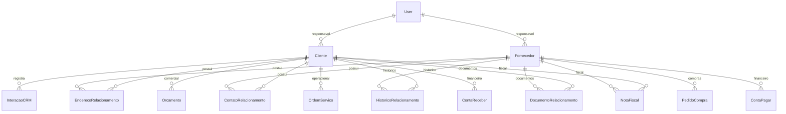

# Prompt 08 - Clientes, Fornecedores e CRM operacional

## Visao geral

O Prompt 08 transforma Clientes e Fornecedores na base central de relacionamento do Nexor ERP. O modulo agora suporta pessoa fisica/juridica, documentos, status, credito futuro, responsavel, multiplos enderecos, multiplos contatos, historico de relacionamento, anexos desacoplados e CRM operacional.

## DER

## Backend

- Models: `Cliente`, `Fornecedor`, `EnderecoRelacionamento`, `ContatoRelacionamento`, `InteracaoCRM`, `HistoricoRelacionamento` e `DocumentoRelacionamento`.
- Enums: tipo de pessoa, status de relacionamento, tipo de endereco, tipo/status de interacao CRM, tipo de historico e categoria de fornecedor.
- Serializers: cadastro completo com enderecos e contatos aninhados, historico e interacoes CRM.
- Services: regras transacionais com `transaction.atomic()`, validacao server-side, soft delete e historico automatico.
- Selectors: queries otimizadas com `prefetch_related`, `select_related` e historico consolidado com orcamentos, OS, financeiro e fiscal.
- Repositories: pontos de lock `select_for_update()` para evolucao de fluxos concorrentes.
- Views/URLs: endpoints REST versionados e respostas padronizadas em `success/message/data`.
- Permissions: RBAC preparado para administrador, comercial, compras, financeiro, operacional e supervisor.

## APIs entregues

- `GET/POST /api/v1/clientes/`
- `GET/PUT/DELETE /api/v1/clientes/{id}/`
- `GET /api/v1/clientes/{id}/historico/`
- `GET/POST /api/v1/clientes/{id}/interacoes/`
- `GET/POST /api/v1/fornecedores/`
- `GET/PUT/DELETE /api/v1/fornecedores/{id}/`
- `GET /api/v1/fornecedores/{id}/historico/`
- `GET/POST /api/v1/crm/interacoes/`
- `PUT /api/v1/crm/interacoes/{id}/`
- `POST /api/v1/crm/interacoes/{id}/finalizar/`

Rotas legadas `/api/v1/clientes/clientes/` e `/api/v1/fornecedores/fornecedores/` foram mantidas para nao quebrar chamadas antigas.

## Validacoes

- CPF/CNPJ valido.
- IE com tamanho minimo/maximo por UF preparada.
- Email valido.
- CEP valido.
- Nome/razao social obrigatorio.
- Bloqueio de CPF/CNPJ ativo duplicado.
- Interacao CRM obrigatoriamente com responsavel.
- Exclusao fisica bloqueada por soft delete.

## Fluxo CRM

1. Usuario registra interacao no cliente ou em `/api/v1/crm/interacoes/`.
2. Service valida responsavel e cria `InteracaoCRM`.
3. Historico do cliente recebe evento do tipo `interacao`.
4. Finalizacao altera status para `finalizado` e registra novo evento.

## Integracoes

- Orcamentos usam `Cliente` e aparecem no historico consolidado.
- Ordens de servico usam `Cliente` e aparecem no historico operacional.
- Financeiro usa `Cliente` em contas a receber e `Fornecedor` em contas a pagar.
- Compras usam `Fornecedor` em pedidos de compra.
- Fiscal usa `Cliente` e `Fornecedor` diretamente em NFe, evitando duplicacao do cadastro principal.

## Frontend

- Lista de clientes com busca, filtro e status.
- Cadastro de cliente.
- Detalhe do cliente com cards, historico e interacoes.
- Lista e cadastro de fornecedores.
- CRM operacional com criacao e finalizacao de interacoes.
- Sidebar, rotas e cards de modulos atualizados.

## Testes

- Clientes: criacao valida, CPF invalido, CNPJ invalido, duplicidade, inativacao e CRM.
- Fornecedores: criacao valida, IE invalida e inativacao.

## Melhorias futuras

- Pipeline comercial com funil.
- SLA e tickets de atendimento.
- Portal do cliente.
- Armazenamento externo de documentos em S3/minio.
- Multiempresa com segregacao por tenant.
