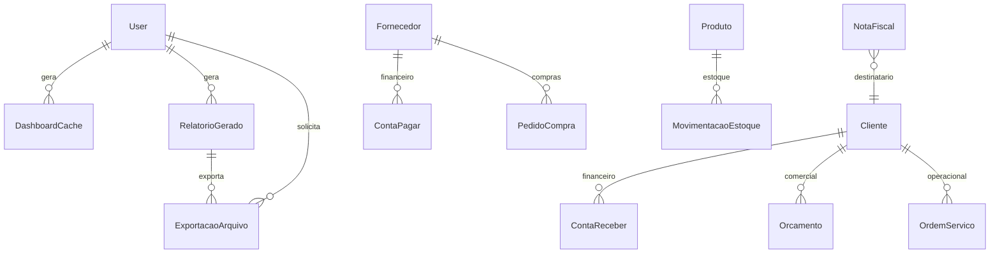

# Prompt 09 - Dashboard, Relatorios e Business Intelligence

## Visao geral

O Prompt 09 implementa o centro analitico do Nexor ERP, com dashboards executivos e setoriais, relatorios gerenciais, exportacoes e base para BI operacional com cache e Celery.

## Arquitetura analitica

- Selectors consolidam dados com `aggregate`, `annotate`, `select_related` e filtros.
- Services aplicam regras, cache e registro de historico.
- Views apenas recebem filtros, validam permissao e retornam respostas padronizadas.
- Exportadores ficam isolados em `apps/relatorios/exports`.
- Celery fica preparado em `apps/relatorios/tasks.py`.

## DER

## Backend

- Models: `DashboardCache`, `RelatorioGerado`, `ExportacaoArquivo` e compatibilidade com `RelatoriosRecord`.
- Enums: tipos de dashboard, relatorio, formato de exportacao e status de exportacao.
- Services: `DashboardService` e `RelatorioService`.
- Selectors: indicadores executivo, financeiro, estoque, comercial, operacional e relatorios por dominio.
- Repositories: locks para cache, relatorios e exportacoes.
- Permissions: RBAC para administrador, diretoria, financeiro, comercial, operacional e supervisor.
- Validators: periodo, filtros avancados e estrutura de exportacao.
- Cache: Redis via `django.core.cache.backends.redis.RedisCache`.
- Celery: task `gerar_exportacao_relatorio` pronta para processamento assíncrono.

## APIs

- `GET /api/v1/dashboard/executivo/`
- `GET /api/v1/dashboard/financeiro/`
- `GET /api/v1/dashboard/estoque/`
- `GET /api/v1/dashboard/comercial/`
- `GET /api/v1/dashboard/operacional/`
- `GET /api/v1/relatorios/financeiro/`
- `GET /api/v1/relatorios/estoque/`
- `GET /api/v1/relatorios/comercial/`
- `GET /api/v1/relatorios/os/`
- `GET /api/v1/relatorios/compras/`
- `POST /api/v1/relatorios/exportar/pdf/`
- `POST /api/v1/relatorios/exportar/excel/`
- `POST /api/v1/relatorios/exportar/csv/`
- `GET /api/v1/relatorios/exportacoes/`

## Frontend

- Dashboard executivo na tela inicial.
- Dashboards financeiro, estoque, comercial e operacional.
- Central de relatorios com exportacao PDF, Excel e CSV.
- Componentes: KPI cards, filtros de periodo, graficos Recharts e tabela de exportacoes.

## Graficos

O frontend usa Recharts para area, barras e pizza, evitando graficos improvisados e mantendo estrutura madura para BI.

## Testes

- Dashboard com cache.
- Validacao de periodo.
- Geracao de relatorio.
- Exportacao CSV.

## Melhorias futuras

- Processamento 100% assíncrono de exportacoes pesadas.
- Metas por area.
- Data warehouse.
- Dashboards customizaveis por usuario.
- Code splitting dos graficos para reduzir o bundle inicial.
